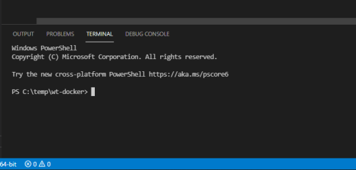
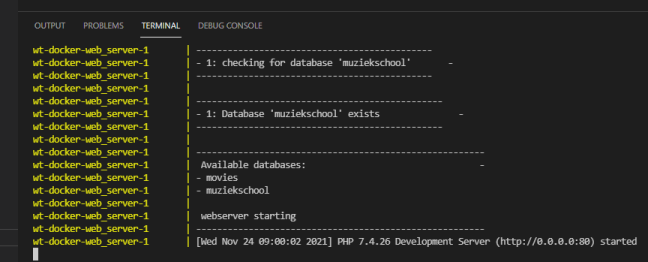
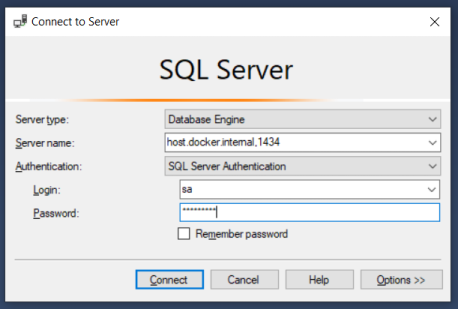
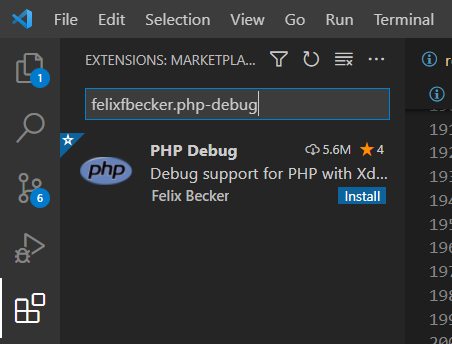

# WT-IS: Docker webserver met database

Deze omgeving maakt een database server en een web server aan gebaseerd
op [Docker](https://www.docker.com/). Bij het opstarten van de omgeving
wordt automatisch de database *Fletnix* aangemaakt en gevuld met
voorbeelddata.

***Let op, deze omgeving is specifiek bedoeld als educatieve omgeving.
Deze omgeving kan niet gebruikt worden voor productie-omgevingen,
hiervoor zullen eerst nog een groot aantal beveilingsaspecten opgelost
moeten worden (wachtwoorden zijn eenvoudig te achterhalen, er wordt
gebruik gemaakt van de [Built-in web
server](https://www.php.net/manual/en/features.commandline.webserver.php),
er is altijd een debugger actief etc. etc.).***

## Benodigde software

De volgende software heb je nodig:

### Docker (verplicht)

Installeer Docker: <https://www.docker.com/get-started>. Voor zowel
Windows, Mac als Linux zijn er installaties beschikbaar.

### Visual Studio Code (aanbevolen)

Installeer Visual Studio Code: <https://code.visualstudio.com/>
Waarschijnlijk heb je deze al geïnstalleerd en gebruik je die al om je
HTML-pagina's te maken.

## Eerste keer opstarten en aanmaken omgeving

Bij de eerste keer opstarten van de omgeving worden er veel bestanden
gedownload en duurt het even voordat alles klaar is.

### Clone GitHub-repository naar lokale machine

Clone of download de volledige repository van deze omgeving naar je
lokale machine.

Als je gebruik maakt van GitHub Desktop, klik in de Github-repo op 'Open
with GitHub Desktop'.

### Visual Studio Code: aanmaken van servers

Open met Visual Studio Code de map waarin je repository hebt gecloned.
Met GitHub Desktop: klik op 'Open with Visual Studio Code'.

Onderin Visual Studio Code zou een *terminal* open moeten staan. Als dit
niet het geval is, kies in het menu van Visual Studio Code onder
*Terminal* de optie *New terminal*.

.

Type in de terminal `docker compose up` en daarna *enter*.

Nu worden een database server en een web server aangemaakt. Daarna
worden beide servers opgestart en de *Fletnix* database wordt
automatisch aangemaakt en gevuld. Tijdens dit proces zie je een
behoorlijk aantal meldingen voorbij komen.

*Soms krijg je bij stap 18/19 een foutmelding **ERROR \[18/19\] RUN pecl
install pdo_sqlsrv**. De installatie haalt bestanden van het internet
af, de server die bij deze stap hoort wil nog wel een offline zijn.
Wacht een paar minuten en probeer nog eens. Lukt het na enige keren nog
niet, maak dan de cache leeg m.b.t. `docker system prune -f`.*

Uiteindelijk moet de volgende melding in beeld verschijnen

    -------------------------------------------------------
     Available databases:                                 -
    - movies
    - muziekschool

     webserver starting
    -------------------------------------------------------
    [Wed Nov 24 09:00:02 2021] PHP 7.4.26 Development Server (http://0.0.0.0:80) started

Zoiets als



Test de webserver:

-   *It works!*: <http://localhost:8080> of
    <http://localhost:8080/index.php>
-   *phpinfo*: <http://localhost:8080/phpinfo.php>
-   *Data uit de database*: <http://localhost:8080/moviegenres.php>

## Je eigen bestanden

De bestanden die de webserver gebruikt staan in de map `./applicatie/`,
hier moet je je beroepsproduct in uitwerken.

### Eerste php-bestand

Maak een nieuw bestand aan in de map `./applicatie/` en noem deze
`test.php`. Open dit bestand met Visual Studio Code en voeg de volgende
code toe:

``` .php
<?php
echo ('Hallo **je eigen naam**');
?>
```

Roep de `test.php` in je webbrowser (op de localhost:8080). Als het goed
is zie je de melding *Hallo, \*\*je eigen naam\*\** verschijnen.

### Fletnix applicatie

Kopieer al je HTML-bestanden naar de map `./applicatie/` en verander van
elke bestand de extensie naar `.php`. Roep als test alle bestanden aan
via je browser. Maak nu je web-applicatie zodanig dat deze optimaal van
opzet is en dat de gegevens in de site uit de database gehaald worden.
Zie de lesstof hoe je dat allemaal doet.

Tip: in het bestand `moviegenres.php` (in combinatie met
`db_connectie.php`) kun je een voorbeeld zien hoe je verbinding maakt
met een database en gegevens in een webpagina plaatst.

## Problemen oplossen

### Database bekijken

In het bestand *variables.env* staan de connectiegegevens voor de
database (de user is 'sa').

    DB_HOST="...."
    SA_PASSWORD="...."



### Unable to connect

Als je een melding krijgt dat de pagina niet bereikbaar is

1.  Controleer in de URL of je http://localhost:8080 correct gespeld
    hebt.
2.  Controleer of je in de URL het bestandsnaam (met *.php*) correct
    gespeld hebt.
3.  Controleer of Docker opgestart is.
4.  Controleer of de servers opgestart zijn (type in de VS-code terminal
    `docker compose ls -a` daar moet je docker-omgeving staan met als
    status *running(2)*).
5.  Reboot je machine.

### This error may indicate that the docker daemon is not running.

Als je de melding *error during connect: This error may indicate that
the docker daemon is not running.* dan heb je docker niet opgestart.
Start Docker op of reboot je machine.

### Problemen oplossen onder Windows

#### Te oude computer

Heb je een te oude computer, dan kan je dit dialoogvenster krijgen:


#### WSL 2

Zodra je Docker geïnstalleerd hebt kan je nog enkele waarschuwingen
krijgen over WSL 2 ([*Windows Subsystem for Linux
2*](https://docs.microsoft.com/en-us/windows/wsl/about)). WSL 2 is een
extra onderdeel voor Windows waarmee Docker, Linux en andere
technologieën efficiënt kunnen werken binnen Windows.

Als je een bericht krijgt dat WSL 2 niet geïnstalleerd is, volg dan de
instructies op om WSL 2 wèl te installeren.

Daarna kan je onder andere nog de volgende melding krijgen:

> Please click the link and follow the instructions to install the
> kernel update: ...

Installeer de kernel update zoals gevraagd.

Herstart je computer.


#### Detailinstructies over virtualisatie

Mocht je nog steeds problemen hebben tijdens of direct na de installatie
van Docker Desktop, bestudeer dan de instructies van Docker Inc. onder
het kopje
[*Virtualization*](https://docs.docker.com/docker-for-windows/troubleshoot/#virtualization-must-be-enabled),
alleen die onder de subkopjes *'VIRTUALIZATION MUST BE ENABLED'* en
*'WSL 2 AND WINDOWS HOME'*.

## Debugging (foutopsporing) van je code

Met een [debugger](https://en.wikipedia.org/wiki/Debugging) is het
mogelijk om stapsgewijs door je code heen te lopen om zo fouten op te
kunnen sporen. Het is een handig hulpmiddel om te bekijken wat de code
nu precies doet. Deze omgeving is zo ingericht dat er ee n debugger
actief is, je hebt alleen een extra extensie nodig. De [PHP
Debug](https://marketplace.visualstudio.com/items?itemName=felixfbecker.php-debug)
van Felix Becker dien je te installeren.

### Installatie debugger

Open aan de linkerkant van Visual Studio Code de extensions en zoek op *felixfbecker.php-debug*. Klik op install en wacht tot deze debugger is geïnstalleerd. Bij het opstarten 



### How to debug

